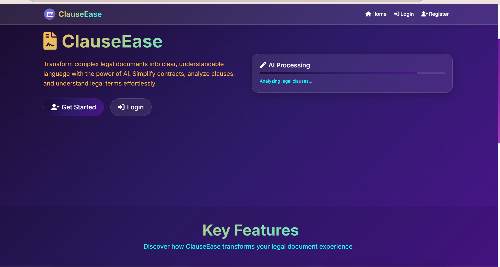
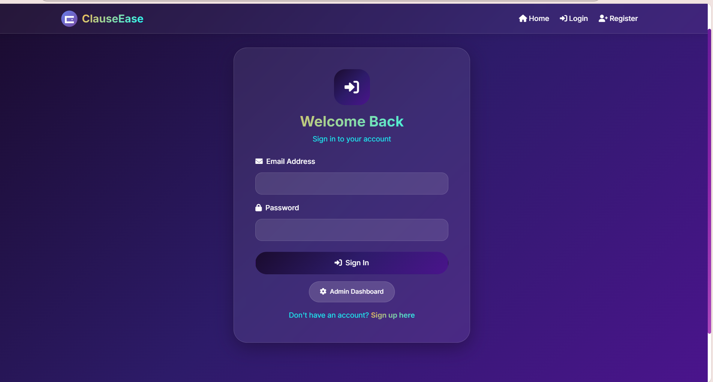
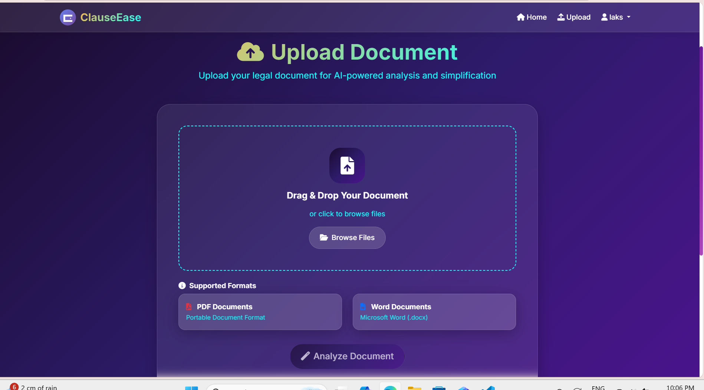
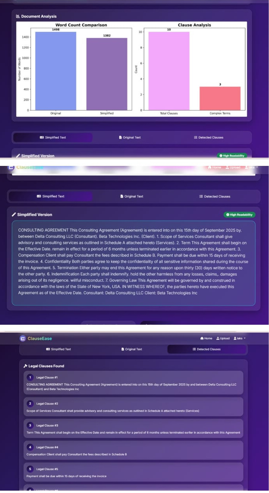

#  ClauseEase — AI-powered Contract Simplifier

ClauseEase is an AI-enhanced web application that extracts, analyzes, simplifies, and summarizes legal clauses from PDF/DOCX documents.  
It highlights detected clauses, legal terms, provides analytics, and allows users to download a simplified version of the contract.

---

##  Key Features

-  **User Authentication** (Register / Login)
-  **Upload PDF or DOCX files**
-  **AI-based Clause Detection**
-  **Legal Term Recognition**
-  **Plain-Language Simplification**
-  **Simple Visual Analytics** (word-count charts, clause summaries)
-  **Download Simplified Contract as `.txt`**
-  **Secure Admin Dashboard** (view users, uploaded documents, logs)
-  **History & Logs (Admin Only)**

---

##  Project Structure

ClauseEase_Project/
│── app.py
│── models.py
│── requirements.txt
│── README.md
│── uploads/ # User uploaded files (ignored in .gitignore)
│── clauseease.db # Local SQLite DB (ignored in .gitignore)
│── static/
│ ├── css/
│ ├── js/
│ ├── images/
│ └── screenshots/ # ALL screenshots go here
│
│── templates/
│ ├── index.html
│ ├── login.html
│ ├── register.html
│ ├── upload.html
│ ├── analyze.html
│ └── admin_database.html
│
└── ai_modules/
├── document_ingestion.py
├── text_preprocessing.py
├── legal_clause_detection.py
├── legal_term_recognition.py
└── language_simplification.py

---

##  Requirements

**Python 3.11 Recommended**

Install using:
pip install -r requirements.txt

Main packages used:
- Flask  
- Flask-Login  
- Flask-SQLAlchemy  
- PyPDF2  
- python-docx  
- matplotlib  
- nltk  
- spacy  

Download required NLTK data:
python -c "import nltk; nltk.download('punkt'); nltk.download('stopwords')"

---

##  How to Run the Project (Windows / VS Code)

### 1️⃣ Open the project in VS Code  
### 2️⃣ Create & activate virtual environment

python -m venv venv
.\venv\Scripts\activate

### 3️⃣ Install dependencies

pip install -r requirements.txt

### 4️⃣ Run the app

python app.py

Then open:

👉 http://127.0.0.1:5000/

---

##  Admin Access (Important)

- Admin panel is meant only for **local machine usage**
- Hardcoded admin email/password should be replaced with environment variables
- Never upload real admin credentials publicly

---

## Downloaded Output

After analysis, ClauseEase generates a **simplified `.txt` contract** that users can download.

---

##  Screenshots

> **NOTE:** Place all screenshot files inside:  
`screenshots/`

###  1. Home Page  

###  2. Login Page  

###  3. Upload Document Page  

###  4. Contract Analysis Result  

###  5. Admin Panel (Secure)  

---

##  License
MIT License

---

##  Acknowledgements

Developed as a complete AI-Assisted Contract Analysis System.  
Includes custom preprocessing, clause detection, legal term recognition & simplification modules.

---

